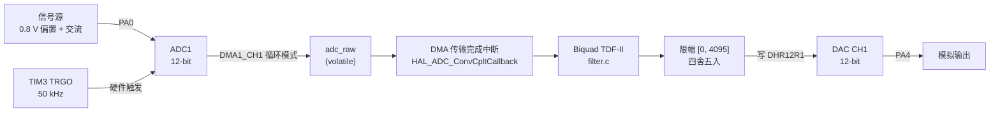

# stm32-iir-filter

**STM32 模拟滤波器仿真器（Analog Filter Emulator）** —— 用纯数字方式实时复现给定二阶模拟传递函数

$$H(s) = \frac{2}{10^{-8}s^2 + 3\times10^{-4}s + 1}$$

50 kHz 硬件定时采样 → DMA 完成中断内逐样本滤波 → 12-bit DAC 重建输出。裸机硬实时（无 RTOS、无缓冲队列），数字输出与模拟参考电路（Sallen-Key 二阶低通 + 比例放大）保持一致，1k/2 kHz 处 Vpp 理论误差 < 1%（验收指标 ≤ 10%）。


## 特性

- **完整可复现的设计链**：`tools/design_filter.py` 从模拟原型 H(s) 出发，经因式分解 + 双线性变换推导出全部固件系数（纯 Python 标准库），并自动与固件锁定值逐位对照、验证模拟/数字一致性
- **50 kHz 硬实时流水**：TIM3 TRGO 硬件触发 ADC 采样（无软件抖动），DMA 循环搬运，转换完成中断内执行转置 II 型（TDF-II）Biquad，主循环零参与
- **数值友好的结构**：TDF-II 仅需 2 个状态变量，对系数舍入与中间溢出的敏感度低于直接 I / II 型；全程 float32 在码值域（0~4095）直接运算，省去过零点的电压换算
- **上电零瞬态**：DAC 预置到稳态电平 + 滤波器状态直接解析置为直流稳态（`biquad_preset_dc`），上电瞬间输出无冲击、无建立过程
- **先验证、后烧录**：宿主机离线测试与固件**编译同一份 `filter.c`**，直流增益 / 幅频 / 相频 / 削顶自动判定 PASS/FAIL，FAIL 即拒绝烧录
- **实时性可观测**：PB0 每次 ISR 翻转出高电平脉宽（示波器直接量 CPU 占用），PC13 心跳灯监视主循环存活

## 硬件平台

| 项目 | 值 |
|---|---|
| MCU | STM32F103RCT6（Cortex-M3 @ 72 MHz，LQFP64，外部 8 MHz 晶振 ×PLL9）|
| 模拟输入 | **PA0**（ADC1_IN0）：0.8 V 直流偏置 + 交流信号，建议 ≤1.5 Vpp |
| 模拟输出 | **PA4**（DAC 通道 1，12-bit）|
| 调试脚 | **PB0**：高电平宽度 = 单次滤波 ISR 耗时；**PC13**：心跳灯（1 Hz）|

## 滤波器指标

| 参数 | 值（离线复算验证） |
|---|---|
| 模拟原型 | H(s) = 2/(10⁻⁸s² + 3×10⁻⁴s + 1)：f₀ ≈ 1591.5 Hz，Q = 1/3（过阻尼、无谐振峰），直流增益 2 |
| 离散化 | 双线性变换（Fs = 50 kHz，不预畸变），见 `tools/design_filter.py` |
| 结构 | 二阶 IIR Biquad，转置直接 II 型 |
| 采样率 Fs | 50 kHz（TIM3：72 MHz / 1 / 1440）|
| 直流增益 | 2.000（+6.02 dB）|
| −3 dB 截止频率 | ≈ 595 Hz |
| @ 1 kHz | 增益 1.009（≈0 dB），相位 −72.2° |
| @ 2 kHz | 增益 0.521（−5.7 dB），相位 −98.9° |
| @ 10 kHz | 增益 0.036（−29 dB）|
| 极点 | 实极点 0.9264 / 0.5850（对应模拟原型转角 607.9 Hz / 4166.7 Hz），单位圆内，稳定 |
| 零点 | z = −1 双重零点（奈奎斯特处深衰减，抑制混叠分量）|

锁定系数（唯一来源：`Core/Src/main.c` 中 `lpf` 初始化，`a1` 自带负号）：

```
b = [0.0152672, 0.0305344, 0.0152672]
a = [1, -1.5114504, 0.5419847]
```

差分方程（TDF-II，顺序不可调换）：

```
y  = b0*x + s1
s1 = b1*x - a1*y + s2
s2 = b2*x - a2*y
```

固件占用（Debug 构建）：FLASH 5.2%，RAM 3.7%。

## 设计流程（模拟原型 → 固件系数）

```
H(s) = 2/(1e-8·s² + 3e-4·s + 1)        模拟原型：f0 ≈ 1591.5 Hz, Q = 1/3（过阻尼）
   │  因式分解：两个一阶低通级联（实极点）
   ▼
wc1 = 3819.66 rad/s (607.9 Hz)         wc2 = 26180.34 rad/s (4166.7 Hz)
   │  双线性变换 s = 2Fs·(1-z⁻¹)/(1+z⁻¹)，Fs = 50 kHz（不预畸变）
   ▼
p1 = 0.9264174, p2 = 0.5850330         每节增益 Ki = (1-pi)/2（单节直流增益恒为 1）
   │  级联 × G=2，合并为单个 Biquad
   ▼
b = [0.0152672, 0.0305344, 0.0152672]  a = [1, -1.5114504, 0.5419847]
   │  锁定进 Core/Src/main.c
   ▼
verify/ + tools/ 离线验证全部 PASS 后才烧录
```

一条命令完整复现设计（含与固件系数逐位对照、可直接粘贴的 C 初始化片段）：

```bash
python tools/design_filter.py
```

**模拟参考 vs 数字实现一致性**（同激励下输出 Vpp 误差，验收指标 ≤ 10%）：

| f | 模拟 \|H(jΩ)\| | 数字 \|H(e^jω)\| | Vpp 误差 | 相位差 |
|---|---|---|---|---|
| 1 kHz | 1.0102 | 1.0092 | **0.10%** | −0.05° |
| 2 kHz | 0.5244 | 0.5213 | **0.58%** | −0.20° |

误差来源是双线性变换的频率翘曲（warping），在 f ≪ Fs/2 = 25 kHz 时可忽略，因此未做预畸变补偿。

## 系统架构



中断调用链：`DMA1_Channel1_IRQHandler → HAL_DMA_IRQHandler → HAL_ADC_ConvCpltCallback`，滤波、限幅、DAC 写入全部在该回调内完成；每样本预算 20 µs（72 MHz 下约 1440 个 CPU 周期），实际 ISR 只做 5 次乘加 + 限幅 + 一次寄存器写，耗时可直接在 PB0 上用示波器读取。

## 目录结构

```
├── Core/
│   ├── Inc/filter.h              # Biquad 模块接口（含差分方程与符号约定文档）
│   └── Src/
│       ├── filter.c              # 核心算法：TDF-II 单样本更新 + 直流稳态预置
│       └── main.c                # 初始化时序、锁定系数、DMA 中断滤波回调
├── verify/                       # 宿主机离线验证（与固件同源编译 filter.c）
│   ├── test_filter.c             # C 版：自动判定 PASS/FAIL，作为烧录门禁
│   └── test_filter.py            # Python 等价版（仅标准库）
├── tools/
│   ├── design_filter.py          # 设计：模拟原型 H(s) → Biquad 系数（双线性变换），与固件逐位对照
│   └── filter_analysis.py        # 分析：零极点、幅相频响应、−3dB 点、锚点交叉验证
├── Drivers/                      # ST HAL 库与 CMSIS（CubeMX 生成）
├── cmake/                        # arm-none-eabi-gcc 工具链与 CubeMX 构建脚本
├── stm32_iir_filter.ioc          # CubeMX 工程文件（引脚 / 时钟 / 外设配置）
├── CMakeLists.txt
└── CMakePresets.json
```

## 构建与烧录

依赖：`arm-none-eabi-gcc`（加入 PATH）、CMake ≥ 3.22、Ninja。（使用 STM32Cube VS Code 扩展的 bundle 工具链亦可直接构建。）

```bash
cmake --preset Debug
cmake --build --preset Debug        # 产物：build/Debug/stm32_iir_filter.elf
```

通过 ST-Link 烧录（OpenOCD / STM32CubeProgrammer / pyOCD 任选）：

```bash
STM32_Programmer_CLI -c port=SWD -w build/Debug/stm32_iir_filter.elf -v -rst
```

需要修改引脚 / 时钟 / 外设配置时，用 STM32CubeMX 打开 `stm32_iir_filter.ioc` 重新生成代码；所有手写代码都位于 `USER CODE BEGIN/END` 标记之间，不会被覆盖（新增 `.c` 文件需手动加入根 `CMakeLists.txt` 的 `target_sources`）。

## 离线验证（无需硬件）

设计 → 分析 → 时域仿真共四层，全部共享同一份数学，任何一层 FAIL 都不烧录：

```bash
# 1) 设计复现：H(s) → Biquad 系数，与固件锁定值逐位对照 + 模拟/数字一致性
python tools/design_filter.py

# 2) 系数分析：零极点 / 频响 / −3dB 点 / 锚点交叉验证
python tools/filter_analysis.py

# 3) 时域仿真（C 版，直接编译板上同一份 Core/Src/filter.c）
gcc -std=c11 -I Core/Inc verify/test_filter.c Core/Src/filter.c -lm -o verify/test_filter
./verify/test_filter                 # Windows: verify\test_filter.exe

# 4) 时域仿真（Python 等价版，仅标准库）
python verify/test_filter.py
```

时域测试激励为码值域正弦 `x = 993 + 930.7·sin(2πf·n/Fs)`（0.8 V 偏置、1.5 Vpp），自动检查：

| 测试项 | 判定锚点 |
|---|---|
| 直流增益 | 2.0000 ± 1e-4 |
| 1 kHz 稳态 | Vpp 1.49~1.53 V，均值 1.60 V，相位 −75°~−69°，不触顶/触底 |
| 2 kHz 稳态 | Vpp 0.76~0.80 V，均值 1.60 V，相位 −102°~−95°，不触顶/触底 |

实测输出示例：

```
==== IIR offline check, Fs=50000 Hz, code-domain (0..4095) ====

[DC ] gain = 2.000000  (target 2.0000)
     PASS
[1kHz] mean=1.6001 V  Vpp=1.5109 V  range=[1048 .. 2924] code  phase=-72.25 deg
     PASS
[2kHz] mean=1.6001 V  Vpp=0.7798 V  range=[1503 .. 2471] code  phase=-98.94 deg
     PASS

==== OVERALL: PASS (allow flashing) ====
```

## 硬件实测

信号源（内阻 50 Ω）输出 0.8 V 偏置 + 0.75 V 幅度正弦（1.5 Vpp）接 PA0，示波器 CH1 = PA0（输入）、CH2 = PA4（输出）：

- **1 kHz**：输入输出幅度基本相等（增益 ≈1），输出滞后约 72°
- **2 kHz**：输出幅度约为输入一半（−5.7 dB），滞后约 99°
- **对照验收**：与模拟参考电路（Sallen-Key 二阶低通 + 比例放大）或其电路仿真施加完全相同激励，输出 Vpp 误差 ≤ 10%、波形基本相同（离线对照的理论误差 < 1%）
- **PB0**：高电平脉宽 = 单次 ISR 耗时，应远小于 20 µs 采样周期
- **PC13**：1 Hz 闪烁；若停闪说明主循环被阻塞（ISR 超时）

> 📷 示波器截图（1 kHz / 2 kHz 输入输出对比、PB0 脉宽）待补充至 `docs/` 目录。

## 设计说明

- **为什么是转置 II 型**：同为二阶，TDF-II 比直接 I 型少一半状态量，且中间状态直接对应输出节点，定点化 / 溢出分析更直观；浮点实现下数值特性也更好
- **为什么在码值域运算**：ADC→DAC 全链路不落地电压量纲，省去两次乘除法与量纲换算误差；线性系统下码值域与电压域结果严格等价
- **上电瞬态处理**：IIR 状态从 0 起步会对 0.8 V 偏置产生建立过程（输出从错误状态收敛）。`biquad_preset_dc` 用直流稳态解析解 `s1 = y − b0·x`，`s2 = b2·x − a2·y`（其中 `y = G·x`）直接预置状态，配合 DAC 输出预置，上电即稳态
- **符号约定**：`a1` 存储时自带负号，差分方程中写作 `−a1·y`——头文件、固件、离线测试三处均有显式注释，防止二次变号
- **为什么不预畸变（prewarping）**：预畸变可精确对齐某个特征频率，但本项目关心频段（≤2 kHz）远低于 Fs/2，裸双线性变换的翘曲误差实测 < 0.6%（`tools/design_filter.py` 输出对照表），远小于 10% 的验收裕度；不预畸变换来的是系数与模拟原型极点之间可直接手算对照的透明性
- **过阻尼原型的实现选择**：Q = 1/3 < 0.707，原型具有一对实极点，等价于两个一阶低通级联；合并为单个 Biquad 实现（而非两节级联），一次中断内 5 次乘加完成，状态量最少

## License

本仓库用户代码（`Core/`、`verify/`、`tools/`、构建脚本）采用 [MIT License](LICENSE)；`Drivers/` 目录为 ST 提供的 HAL 库与 CMSIS，遵循 ST 的 BSD-3-Clause 许可（见各文件头）。
